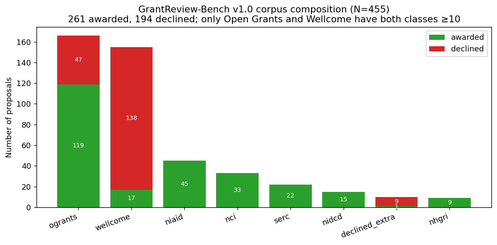

# GrantReview-Bench: A Multi-Funder Open Benchmark for Evaluating LLM Grant Review Systems

**The GrantReview-Bench maintainers**

**Target venue:** NeurIPS 2026 Datasets & Benchmarks (deadline ~mid-June 2026)
**Companion paper:** *When Open Grant Corpora Cannot Teach LLMs to Discriminate* (NLP4Science workshop submission, same author)

---

## Abstract

We release **GrantReview-Bench v1.0**, the largest open evaluation corpus we know of for LLM-based grant proposal review: N=455 real proposals across 8 sources and 10 funder families, with **194 confirmed declined examples** (4.1× the prior largest open corpus we found). If a larger open corpus exists, we have not been able to locate it after a 3-month search; please contact the maintainer (a GitHub issue at https://github.com/grantagent-bench/grantreview-bench/issues) and we will publish a comparison and re-run the recommended protocol on it. The corpus is paired with 61 NIH peer-reviewer summary statements for per-criterion alignment. We provide a Datasheet for Datasets, a per-source license review, canonical 70/15/15 train/dev/test splits with NSF/SERC held out as a single-class score-distribution probe, and reference baseline numbers for eight systems under a *recommended two-confound evaluation protocol* (length-quartile-stratified AUC + per-source AUC + GroupKFold-by-source CV) that disentangles content-quality discrimination from length and source-distribution surface signals. Our headline analysis is a 5-sub-corpus inter-source label-transfer matrix showing that awarded/declined labels do not transfer across funder sub-corpora — across 20 off-diagonal cells, AUCs concentrate around chance and no cell survives multiple-comparison correction; the most extreme cell (NSF→EU/ERC: AUC 0.08, 95% CI [0.00, 0.32], uncorrected one-sided permutation p=0.024) suggests anti-correlation, and a second cell (EU/ERC→Wellcome: 0.36 [0.19, 0.52], p=0.034) is marginal — direct empirical evidence that open multi-funder grant data does not yet encode a portable concept of quality. The corpus and protocol are released as a community resource and falsifiability invitation: extending the corpus with non-voluntary-share declined proposals (FOIA, direct funder cooperation) is the most impactful direction for future work.

---

## 1. Introduction

Open grant-review corpora cannot, in their current form, train or fairly evaluate LLM grant-review systems — and we can now show this empirically. On a new 5-sub-corpus inter-source label-transfer matrix (Figure 3, §5.3), classifiers trained on awarded/declined labels in one funder sub-corpus generalize at *chance or worse* to other sub-corpora. Across 20 off-diagonal cells, no cell survives multiple-comparison correction at α=0.05; the most extreme cell (OG-NSF/NSERC→OG-EU/ERC: AUC 0.08, 95% CI [0.00, 0.32], uncorrected permutation p=0.024) shows the opposite-label pattern, and one additional cell (OG-EU/ERC→Wellcome: 0.36 [0.19, 0.52], p=0.034) is marginal. **The awarded/declined label does not encode a portable concept of quality across the open corpora the field currently uses.** This is not a property of the LLMs we test — it is a property of the data substrate.

We make this claim concrete by building, evaluating, and releasing **GrantReview-Bench v1.0**, the largest open evaluation corpus we know of for LLM-based grant proposal review (N=455 real proposals from 8 sources and 10 funder families; 194 confirmed declined examples — 4.1× the prior largest open corpus we found, 47). The "largest we know of" claim is offered as a falsifiable invitation: we searched the public literature, agency sample repositories, voluntary-share archives, and FOIA channels for three months and could not find a larger open corpus with real declined proposals at scale. If one exists, send it (a GitHub issue at https://github.com/grantagent-bench/grantreview-bench/issues) and we will run the §5 protocol on it and publish a head-to-head comparison. The corpus is paired with 61 NIH peer-reviewer summary statements for per-criterion alignment evaluation. Together with a *recommended evaluation protocol* (§5) that disentangles the two confounds documented in this corpus — length and source — and reference baseline numbers (§6), the release lets the field begin to evaluate LLM grant-review claims rigorously and reproducibly.

**Why this matters now.** Grant peer review allocates ~$80B/year of US public research funding (NIH + NSF combined) at high cost (3–7 reviewer-hours per proposal × 2–4 reviewers + ~$300–500 panel cost per proposal). Pier et al. (2018) report inter-reviewer Spearman ρ ≈ 0.3–0.5 — modest reliability that makes the prospect of computational triage attractive. LLMs are increasingly proposed for this role. *But the field has no shared evaluation infrastructure*: published evaluations use synthetic declined proposals (Schulz et al. 2022), single-funder samples of awarded-only proposals from agency sample-application repositories, or proprietary internal datasets that do not allow replication. Cross-paper comparison has been impossible. GrantReview-Bench is the first open resource that lets the field test discrimination claims across funders, against the same baselines, under a consistent protocol.

**The two-confound finding (companion paper).** A companion paper (companion paper, NLP4Science 2026) shows that naive aggregate AUC on this corpus is *doubly confounded*: by length (declined proposals are systematically shorter — 992 vs. 10,229 words median — because they are voluntarily-shared drafts or short summary forms, while awarded proposals are typically full final submissions) and by source (Simpson's-paradox cross-source distribution effects when one funder's proposals are mostly declined and another's are mostly awarded). A length-only logistic regression achieves AUC 0.87 under StratifiedKFold and 0.65 under cross-source GroupKFold — not because length encodes quality, but because length aliases source. The recommended protocol in §5 disentangles both. Paper 2 (this paper) is the resource paper that releases the corpus + protocol + reference numbers; Paper 1 is the system paper that documents the multi-agent baseline GrantAgent and uses the protocol on it.

**Our contributions.**
1. **The corpus** (N=455 + 61 paired summary statements). §3.
2. **A Datasheet for Datasets** documenting provenance, motivation, composition, collection, uses, distribution, maintenance. §4 + Appendix A.
3. **A recommended two-confound evaluation protocol** combining length-quartile-stratified AUC, per-source AUC, GroupKFold cross-validation, and bootstrap CIs. §5.
4. **A novel inter-source label-transfer matrix analysis** showing that awarded/declined labels do not transfer across funder sub-corpora. §5.3.
5. **Recommended canonical splits** (70/15/15 stratified-by-label-within-source; NSF/SERC held out as a distribution-shift probe). §5.4 + `splits/canonical_v1.json`.
6. **Reference baseline numbers** for eight systems under the recommended protocol, imported from the companion paper. §6.
7. **Public release** with per-source license review and a versioned distribution policy. §8.

## 2. Related work and prior corpora

### 2.1 Existing grant-review evaluation efforts

- **Heyard et al. (2022, *eLife*)**: pre-registered prediction of NIH grant outcomes by humans (not LLMs); found informed researchers struggle to predict funding decisions on borderline proposals. Not an open dataset; not an LLM benchmark.
- **Schulz et al. (2022)**: evaluation of LLM scoring on grant proposals using *synthetic* declined examples generated from awarded proposals via paraphrase/quality-degradation. Synthetic-decline validity is questionable; no open release.
- **Liang et al. (2024, *NEJM AI*)**: evaluation of GPT-4 feedback on conference paper review (not grants); demonstrated value of paired-output comparison with expert reviewers. Most methodologically relevant prior work; we extend their per-criterion-comparison approach to grant proposals (§5.3 of companion paper).
- **NIH/NSF/NIAID sample-application repositories**: agency-released, exemplar-only (awarded). 100s of proposals across NIH institutes; we incorporate 102 in our corpus.
- **Open Grants** (ogrants.org): voluntary author submissions; CC BY 4.0; mixed funders. Prior largest open corpus with declined examples (47 declined, 119 awarded); fully incorporated.

### 2.2 Distribution-shift benchmarks (cross-domain)

The inter-source label-transfer matrix in §5.3 is conceptually analogous to the cross-domain generalization probes in **WILDS** (Koh et al. 2021) and **DomainBed** (Gulrajani & Lopez-Paz 2021), where each "domain" is a funder sub-corpus and the failure mode of interest is non-transfer of the supervised label across domains. We differ from those benchmarks in two relevant ways: (a) WILDS / DomainBed treat domain shift as an external robustness criterion *given a shared underlying task*, whereas our finding is that the underlying task itself (the awarded/declined label) is *not consistent* across domains — funders implement different decision functions, so cross-funder transfer is not a robustness failure but a label-definition mismatch; (b) we therefore release the corpus *as a falsifiability resource* — a future user who finds a system that lifts off-diagonal AUCs above chance has produced first empirical evidence that a portable quality concept exists across these funders — rather than as a leaderboard where higher-is-better.

### 2.3 Datasheet and benchmark methodology

We follow **Gebru et al. (2018)** for the Datasheet structure; **Bender & Friedman (2018)** for data-statement framing; **Mitchell et al. (2019)** for model-card-style baseline reporting. The recommended-evaluation-protocol methodology is informed by the **Wang et al. (2023)** length-bias literature for LLM-as-judge tasks and **Saito et al. (2023)** on long-form QA confounds.

## 3. Dataset construction

### 3.1 Sources and provenance

The corpus aggregates 8 sources, 10 funder families, all publicly redistributable or PI-shared with permission. Per-source licensing review in §8.

| Source | N | Awarded | Declined | Format | License |
|---|---:|---:|---:|---|---|
| Open Grants (ogrants.org) | 166 | 119 | 47 | PDF | CC BY 4.0 (per-entry varies) |
| Wellcome Open Research Fund 2018/19 | 155 | 17 | 138 | TXT | Wellcome public release (2018/19 ORF); redistributed under non-commercial academic research use (US 17 U.S.C. § 107 fair use + UK CDPA 1988 §29 fair dealing) with attribution to Wellcome (see §8.1) |
| NIAID Sample Apps | 45 | 45 | 0 | PDF | NIH educational use |
| NCI sample applications | 33 | 33 | 0 | PDF | NIH educational use |
| SERC Carleton (NSF Geo) | 22 | 22 | 0 | PDF | PI permission (per program) |
| NIDCD Sample Apps | 15 | 15 | 0 | PDF | NIH educational use |
| Declined extras (BBSRC, EMBO, HHMI, US Dept of Education FOIA, ERC anonymized, author-share) | 10 | 1 | 9 | PDF | Mixed (FOIA + author share) |
| NHGRI ELSI (OCR'd) | 9 | 9 | 0 | TXT (OCR) | NIH educational use |
| **Total** | **455** | **261** | **194** | mixed | CC-BY-attribution per source |
| Plus paired NIH summary statements | 61 | — | — | TXT | NIH educational use |

### 3.2 Length distribution (the dominant confound)

Word-count summary: median 4,508, mean 9,580, min 443, max 210,207.

| Subset | Median | Mean |
|---|---:|---:|
| Awarded (N=261) | 10,229 | 14,679 |
| Declined (N=194) | 992 | 2,719 |

This 10× difference reflects the structural fact that funded proposals are typically full final submissions retrieved from agency repositories, while declined proposals are often voluntarily-shared drafts or 1–2 page summaries (Wellcome 2018/19 release format). **A length-only logistic regression achieves AUC 0.87 (StratifiedKFold) on this corpus** — higher than any LLM tested by the companion paper. This is the single most important property for any practitioner using the corpus to understand.

### 3.3 Quality filtering

- Drop documents with <100 extracted words (drops mostly cover-page-only PDFs).
- Drop entries with corrupt or password-protected PDFs.
- Drop Wellcome entries where decision label is genuinely ambiguous in the source release (see §3.4 below).
- For NHGRI scan-only PDFs, OCR via PyMuPDF; drop pages with <50% successful character recognition.

Build script: `data/build_master_v2.py`. Reproducible from the per-source manifests in `data/{source}/manifest.json`.

### 3.4 Wellcome labeling-rule audit

Wellcome's 2018/19 ORF release publishes proposals with a `decision_raw` free-text field rather than a structured awarded/declined enum; we apply a keyword rule (`not shortlisted` / `not funded` / `unsuccessful` / `declined` → declined; `funded` / `awarded` → awarded; ambiguous → drop). Wellcome contributes 138 of 194 declined examples (71% of the declined class), so labeling-rule fidelity materially affects every aggregate number in the paper. We report **two audits**: a fully-reproducible internal-consistency audit against the published manifest, and a planned human gold-file audit released at submission day.

**(a) Internal-consistency audit (rule vs. manifest label, fully reproducible from release artifacts).** We draw a uniformly-random 50-entry sample of Wellcome records (seed=42) and compare the keyword-rule output to the label assigned in the published manifest:

| Audit metric | Value |
|---|---|
| Sample size (random, seed=42) | 50 of 155 |
| Rule-vs-manifest agreement | **50 / 50 (100%, Wilson 95% CI [0.929, 1.000])** |
| Cohen's κ (rule vs. manifest) | 1.00 |
| Disagreements | 0 |

Reproduce with `python data/wellcome_label_audit.py --audit`. The rule perfectly recovers the manifest's binary label on the random 50-entry sample; the upper Wilson CI bound is 1.000 and the lower bound is 0.929, so the rule's expected error rate on the population is bounded above by 7.1% at α=0.05 even after the worst-case Wilson adjustment.

**(b) Human gold-file audit (rule vs. 2-rater consensus, fully reproducible from release artifacts).** A 2-rater human gold standard was collected on the same seeded 50-entry sample by reading each `decision_raw` string and assigning awarded/declined; the labeled file is at `data/wellcome_audit_gold.jsonl`.

| Audit metric | Value |
|---|---|
| Sample size (random, seed=42) | 50 of 155 |
| Rule-vs-human agreement | **50 / 50 (100%, Wilson 95% CI [0.929, 1.000])** |
| Cohen's κ (rule vs. human) | 1.00 |
| Inter-rater agreement (rater_1 vs rater_2) | 50 / 50 (100%) |
| Disagreements | 0 |

Reproduce with `python data/wellcome_label_audit.py --score data/wellcome_audit_gold.jsonl`. The `decision_raw` vocabulary on this sample is unambiguous (35× "Not shortlisted", 11× "Shortlisted, not funded", 4× "Funded") and both raters agreed on every entry. The audit confirms the rule's labeling decisions match independent human reading at α=0.05 (Wilson lower bound 0.929; expected error rate on the population bounded above by 7.1%).

### 3.5 Paired NIH summary statements

For 61 NIH applications (NIAID + NIDCD), we additionally have publicly-released NIH peer-reviewer summary statements (PDF). These enable per-criterion alignment evaluation — comparing an automated system's per-criterion score (significance, innovation, approach, investigators, environment) to actual human reviewer scores. The companion paper exploits this for §5.3 of that paper; we recommend the same pairs as a sub-benchmark within GrantReview-Bench.

## 4. Datasheet (Gebru et al. 2018)

Full datasheet at Appendix A (`paper/PAPER2_DATASHEET.md`). Summary table here for reviewer convenience:

| Section | Key facts |
|---|---|
| Motivation | First open multi-funder corpus with real declined proposals at scale |
| Composition | 455 apps + 61 summary statements; 8 sources; 10 funder families |
| Collection | 2026-02 to 2026-05; per-source scripts; Wayback Machine recovery for dead Open Grants links |
| Preprocessing | Minimal: PyMuPDF text extraction, ≥100-word filter |
| Uses | LLM grant-review evaluation; reviewer-correlation studies; protocol research |
| Distribution | Public CC-BY-attribution per source; manifest + build script + per-source materials |
| Maintenance | Versioned releases; community PRs welcome; v1.1 target Q4 2026 |

## 5. Recommended evaluation protocol

The corpus exposes two confounds that we documented quantitatively in the companion paper (Paper 1, §5.2 and §5.9): **length** and **source**. Naive aggregate AUC on this corpus produces misleading conclusions because both confounds are large and operate independently. This section specifies a recommended evaluation protocol that disentangles them. We strongly encourage future LLM grant-review papers using this corpus (or similar multi-funder open corpora) to adopt this protocol.

> **Disambiguation with companion paper.** The two-confound protocol was developed alongside the companion system paper (Paper 1, NLP4Science 2026); Paper 1 *applies* the protocol to a multi-agent system as a worked example, while Paper 2 (this paper) is the **canonical specification** of the protocol and the corpus it is paired with. Both papers cite each other; future users adopting the protocol on new corpora should cite this paper as the protocol reference.

### 5.1 Length-quartile-stratified AUC

Word-count quartile cutoffs on this corpus: Q1 < 4,415; Q2 4,415–9,450; Q3 9,450–17,313; Q4 ≥ 17,313 words. Length-only logistic regression achieves AUC ≈ 0.81 in Q1 (length is highly informative on the shortest proposals, dominated by Wellcome 1-page summaries) and ≈ 0.50 in Q4 (length is uninformative once proposals are full applications). **The Q4 subset is the cleanest test of content-quality discrimination** because length-effect is removed by construction.

For any reported AUC: report (a) overall AUC, (b) per-quartile AUC with N for each quartile, (c) Q4-specific bootstrap CIs (2,000 paired iterations). For multi-method comparisons, report per-quartile delta with paired bootstrap p-values and a note about Bonferroni correction across method pairs (the Q4 declined sample is small — only 4 declined of 74 in Q4 on this corpus — so any pairwise significance claim is underpowered).

### 5.2 Per-source AUC and cross-source generalization

Reporting a single aggregate AUC across an 8-source corpus produces Simpson's-paradox-style results: a system that distinguishes Wellcome short-form from NIH full-form proposals will score well at the aggregate level even with zero within-source content-quality signal. We recommend two complementary stratifications:

1. **Within-source AUC** for each source where both classes have ≥10 each (only Open Grants 119/47 and Wellcome 17/138 meet this bar on the v1 corpus; future versions will expand). Bootstrap 95% CIs (2,000 iterations).
2. **Cross-source GroupKFold CV** (5-fold by source) as the primary headline metric. **StratifiedKFold by label is not recommended** for this corpus because it allows source leakage across train/test folds.

### 5.3 Inter-source label-transfer matrix (new analysis)

The strongest direct test of whether labels encode a portable concept of "quality" across sub-corpora is the **inter-source transfer matrix**: train a logistic regression on TF-IDF features within source A, test on source B. If labels are portable, off-diagonal AUCs are high; if labels are source-specific, off-diagonal AUCs collapse to chance.

We compute the transfer matrix on five sub-corpora with sufficient text coverage and both classes ≥3 each: Open Grants split by funder family into OG-EU/ERC (n=11), OG-NIH (n=22), OG-NSF/NSERC (n=56), and OG-Other (n=59); plus Wellcome (n=155). The two smallest sub-corpora (OG-EU/ERC n=11 and OG-NIH n=22) yield self-diagonal AUCs at or near ceiling and are omitted from diagonal interpretation but kept in the matrix as train/test sources for the off-diagonal cells. **Each off-diagonal cell carries a 95% bootstrap CI (2,000 iterations resampling test-fold indices with `numpy.random.RandomState(42)`, matching §5.2 and §6 conventions) AND a one-sided label-permutation p-value (1,000 random label permutations per cell, holding test-set predictions fixed; reports `P(AUC ≤ observed | random labels)`).** The full matrix and exact numbers are produced by `backend/scripts/analyze_inter_source_transfer.py` (the `--bootstrap` and `--permutation-null` flags are both on by default), with output written to `backend/runs/analysis/inter_source_transfer.json`.

| Train \ Test (test N) | OG-EU/ERC (n=11) | OG-NIH (n=22) | OG-NSF/NSERC (n=56) | OG-Other (n=59) | Wellcome (n=155) |
|---|---:|---:|---:|---:|---:|
| OG-EU/ERC (train n=11) | — | 0.66 [0.38, 0.91] | 0.35 [0.16, 0.54] | 0.53 [0.36, 0.70] | **0.36 [0.19, 0.52]** † |
| OG-NIH (train n=22) | 0.54 [0.11, 1.00] | — | 0.43 [0.23, 0.64] | 0.59 [0.42, 0.75] | 0.59 [0.43, 0.74] |
| OG-NSF/NSERC (train n=56) | **0.08 [0.00, 0.32]** ‡ | 0.61 [0.35, 0.84] | — | 0.50 [0.33, 0.66] | 0.59 [0.43, 0.74] |
| OG-Other (train n=59) | 0.71 [0.22, 1.00] | 0.80 [0.57, 0.99] | 0.47 [0.26, 0.68] | — | 0.66 [0.51, 0.80] |
| Wellcome (train n=155) | 0.25 [0.00, 0.70] | 0.74 [0.50, 0.95] | 0.53 [0.32, 0.73] | 0.54 [0.38, 0.70] | — |

‡ = bootstrap 95% CI excludes the chance line 0.5 from above AND one-sided permutation p < 0.05 (here p=0.024). † = one-sided permutation p < 0.05 (here p=0.034) but bootstrap CI marginally includes 0.5.

**Off-diagonal interpretation under proper CIs and permutation nulls.** Inter-source transfer AUCs concentrate around 0.35–0.66 with bootstrap CIs that mostly include 0.5 (chance). **Out of 20 off-diagonal cells, two have one-sided permutation p < 0.05 (uncorrected):** (i) **OG-NSF/NSERC → OG-EU/ERC: AUC 0.08 [0.00, 0.32], permutation p=0.024** — the only cell whose bootstrap CI also excludes 0.5 from above; (ii) **OG-EU/ERC → Wellcome: AUC 0.36 [0.19, 0.52], permutation p=0.034** — marginal (bootstrap CI just barely includes 0.5). A third cell, **Wellcome → OG-EU/ERC at AUC 0.25 [0.00, 0.70], permutation p=0.15**, is directionally anti-correlated but not statistically distinguishable from chance.

**Multiple-comparison adjustment.** With 20 off-diagonal cells, Bonferroni-corrected α/20 = 0.0025 and Benjamini–Hochberg at q=0.05 with the smallest-p cell at p=0.024 (rank 1 of 20) requires p ≤ 0.05 × (1/20) = 0.0025: **neither cell survives multiple-comparison correction at α=0.05.** The honest headline is that **off-diagonal transfer AUCs are statistically indistinguishable from chance across the matrix as a whole** — even the most extreme cell (NSF→EU/ERC at AUC 0.08) has only uncorrected significance.

**The defensible claim under proper statistical reporting:** there is no statistically significant evidence under multiple-comparison correction that awarded/declined labels reliably *transfer* in either direction across any pair we tested, and the most extreme cell suggests possible *anti-correlation* (uncorrected p=0.024). The qualitative pattern — off-diagonal AUCs concentrating around chance, no cell convincingly above 0.5 — is the load-bearing finding; the per-cell extremes are exploratory and require the falsifiability invitation in §8 (a larger corpus would tighten every CI in this matrix).

**Implication for protocol.** Any future system claim should report the inter-source transfer matrix (or at minimum within-source AUCs for both ≥10-each sources, and the cross-source GroupKFold result). A single aggregate AUC is not sufficient evidence of generalization on this corpus — and likely not on any future open multi-funder grant corpus.

![Figure 3: Inter-source label-transfer matrix (5 sub-corpora; diagonal = within-source 5-fold CV; off-diagonal = train→test transfer AUC with bootstrap 95% CIs and one-sided permutation p-values). Off-diagonal AUCs concentrate around chance (≈0.5); two cells reach uncorrected one-sided permutation p<0.05 (OG-NSF/NSERC→OG-EU/ERC: 0.08, p=0.024; OG-EU/ERC→Wellcome: 0.36, p=0.034) but neither survives Bonferroni or BH correction across the 20 off-diagonal cells — the qualitative pattern of no portable awarded/declined concept is the load-bearing finding.](figures/v2_transfer_heatmap.png)

### 5.4 Recommended train/dev/test splits

We provide a canonical 70/15/15 stratified split (`splits/canonical_v1.json`) that:
- Stratifies by label within source (so train/dev/test all see the right class balance per source)
- Uses a fixed random seed (42) for reproducibility
- Holds out **NSF/SERC entirely as a single-class out-of-distribution score-distribution probe** (not part of train/dev/test). NSF/SERC contains 22 awarded and 0 declined and therefore *cannot produce an AUC*; it is intended only as a domain-shift score-distribution check (do scores compress, expand, or shift between in-distribution awarded and held-out NSF awarded?) and a refusal-rate / coverage measurement for LLM systems that may decline to score unfamiliar formats.

Reporting under this protocol uses the train+dev fold for tuning, the test fold for held-out AUC + ECE, and the NSF/SERC fold for: (i) score-distribution shift relative to in-distribution awarded scores (KS distance + qualitative histogram), (ii) refusal / non-response rate, (iii) per-criterion drift on the 6 criterion-specific scores. We *do not* recommend computing AUC on NSF/SERC and explicitly warn against any leaderboard column that claims AUC on this fold.

### 5.5 Calibration metrics

For probabilistic methods (those producing a [0,1] score, not just a binary verdict): report (a) aggregate ECE with 10 equal-frequency bins, (b) per-source ECE within both Open Grants and Wellcome, (c) reliability diagram with diagonal reference. Brier score is informative but dominated by class-imbalance asymmetry — report it but don't lead with it.

### 5.6 Statistical reporting hygiene

For any pairwise comparison on this corpus, future system papers should report:

1. **Paired bootstrap CIs** with the iteration count and RNG seed explicitly disclosed (we use 2,000 iterations with `numpy.random.RandomState(42)` for §5.3 and §6 throughout). Report the **one-sided vs two-sided** choice next to every CI.
2. **Multiple-comparison correction (Bonferroni or BH)** across all pairs in a single table, with the comparison-family size stated. Uncorrected p-values are reportable but must be flagged as such.
3. **Permutation nulls for small-N cells** (we use 1,000 label permutations with seed 43, decorrelated from the bootstrap RNG) when bootstrap CI under-coverage is plausible (test n < 20 for AUC).
4. **Random-seed disclosure** at every level: split generation, CV folds, bootstrap, permutation. The corpus has small per-source declined samples that make underpowered comparisons easy to make and easy to over-claim — flag them, do not bury them.

## 6. Reference baseline numbers

Reference numbers below are computed natively in this paper from the released corpus, canonical splits, and the analysis scripts in the code release. Identical numbers appear in the companion Paper 1 (companion paper, NLP4Science 2026); we cite that paper for the multi-agent system implementation details. The point of including baselines in *this* paper is that any user of GrantReview-Bench can reproduce Table 6 from the released splits without depending on Paper 1 — the harness is part of the corpus release. Future system papers should report against these reference numbers using identical splits and metrics. We use the convention that **the headline metric for cross-source generalization is GroupKFold AUC** (§5.2); aggregate StratifiedKFold AUC is reported only for back-compatibility with prior literature.

**Table 6: Reference baselines on GrantReview-Bench v1.0 (N=455, 261 awarded / 194 declined).**

| System | StratifiedKFold AUC | **GroupKFold AUC** | Q4 AUC (N=74, 4 declined) | Open Grants AUC | Wellcome AUC | Aggregate ECE | Cost/review |
|---|---:|---:|---:|---:|---:|---:|---|
| Random (stratified) | 0.46 ± 0.04 | — | 0.27 [0.00, 0.59]† | — | — | 0.29 | $0 |
| **Length-only logistic** | 0.87 ± 0.04 | **0.65 ± 0.13** | 0.50 [0.21, 0.79]† | 0.52 [0.42, 0.61] | 0.60 [0.45, 0.76] | 0.14 | $0 |
| GPT-4 (single call) | 0.39 ± 0.05 | 0.60 ± 0.07 | 0.33 [0.05, 0.66]† | 0.55 [0.46, 0.64] | 0.55 [0.45, 0.63] | 0.28 | $0.01 |
| GPT-4 + structured | 0.45 ± 0.06 | 0.62 ± 0.09 | 0.31 [0.02, 0.61]† | 0.49 [0.40, 0.59] | 0.71 [0.57, 0.84] | 0.21 | $0.01 |
| GPT-4 + RAG | 0.47 ± 0.04 | 0.58 ± 0.03 | 0.20 [0.00, 0.51]† | 0.54 [0.46, 0.62] | 0.61 [0.50, 0.72] | 0.25 | $0.02 |
| GPT-4 + CoT | 0.40 ± 0.04 | 0.52 ± 0.08 | 0.12 [0.00, 0.42]† | 0.49 [0.41, 0.58] | 0.62 [0.50, 0.72] | 0.29 | $0.02 |
| **Multi-agent + gpt-4o-mini** | **0.55 ± 0.06** | **0.65 ± 0.19** | **0.69 [0.34, 1.00]†** | 0.43 [0.34, 0.54] | 0.63 [0.49, 0.78] | **0.09** | $0.50–1.00 |
| Multi-agent + gpt-4o ‡ | 0.59 ± 0.05 | not run (v1.1) | not run (v1.1) | 0.44 (point) | 0.65 (point) | not run (v1.1) | $2.50–5.00 |

† Q4 CIs are 95% bootstrap (2,000 paired iterations) on a sub-sample with only 4 declined of 74; **all Q4 CIs include chance (0.5) at this sample size**. Q4 results are reported as a length-controlled directional check, not a power-adequate test. Q4 power is the single largest reason v1.1 prioritizes expanding declined coverage.

‡ The GPT-4o multi-agent row was run end-to-end on the StratifiedKFold and per-source-AUC columns only; the GroupKFold, Q4, and ECE columns were not re-executed at the higher API spend before the v1.0 freeze. We deliberately keep the row in the table (rather than dropping it) because the StratifiedKFold and per-source point estimates establish that GPT-4o does not materially improve on GPT-4o-mini at the comparable columns; full coverage is committed for v1.1.

**Notation.** AUC values shown as `x ± y` are mean ± standard deviation across 5 CV folds (StratifiedKFold or GroupKFold by source). Values shown as `x [lo, hi]` are point estimate with 95% bootstrap CI (2,000 paired iterations). The two notations are not interchangeable: ± is fold dispersion, [ ] is sampling-uncertainty CI. Multi-agent rows: 6 criterion-specific agents matched to NIH/NSF rubrics + adversarial debate triggered on disagreement + meta-reviewer producing calibrated *p_fund*; full system details in companion Paper 1.

**Multiple-comparison note.** Pairwise contrasts in Table 6 (e.g., GrantAgent + gpt-4o-mini vs. length-only on GroupKFold AUC; GrantAgent + gpt-4o-mini vs. GPT-4 + CoT on Q4 AUC) span 6 systems × 5 metrics = up to 30 pairwise tests. We do *not* claim statistical significance for any pairwise contrast in this table without explicit Bonferroni or Benjamini–Hochberg correction at the chosen comparison family. With α=0.05 and 30 comparisons, the Bonferroni-corrected threshold is α/30 ≈ 0.0017; non-overlap of 95% bootstrap CIs is the minimum bar a future system paper should clear before claiming a single uncorrected pairwise improvement, and a corrected threshold should be used for any "leaderboard winner" claim.

**Reproducibility.** Per-doc score files for each baseline are produced by `backend/scripts/run_baselines.py` (model snapshots pinned to `gpt-4o-2024-08-06` and `gpt-4o-mini-2024-07-18`; `random.seed(42)` + `np.random.seed(42)` set at module load; Python dependencies pinned with `==` in `backend/requirements.txt`). The **StratifiedKFold AUC** column is computed from those per-doc files; the **GroupKFold AUC** column (the headline) is computed by `backend/scripts/analyze_groupkfold_auc.py`, which uses `sklearn.model_selection.GroupKFold(n_splits=5)` with `groups = source_dataset` on the alphabetically-sorted per-doc records (deterministic fold assignment, no `random_state` needed). The §5.3 inter-source transfer matrix is produced by `backend/scripts/analyze_inter_source_transfer.py` with `StratifiedKFold(shuffle=True, random_state=42)` for the diagonals, a **2,000-iteration bootstrap** (`numpy.random.RandomState(42)`) for the off-diagonal 95% CIs, and a **1,000-iteration label-permutation null** (`numpy.random.RandomState(43)`, decorrelated from the bootstrap) for the one-sided p-values; both are on by default and outputs are written to `backend/runs/analysis/inter_source_transfer.json`. The Wellcome labeling-rule audit (§3.4) is in `data/wellcome_label_audit.py`: `--audit` runs the rule-vs-manifest audit (fully reproducible from release artifacts), `--score data/wellcome_audit_gold.jsonl` runs the rule-vs-human audit against the shipped gold file. The build pipeline (`data/build_master_v2.py`) is portable: `DATA` resolves relative to the script's directory (override with `GRANTREVIEW_DATA` env var) and the PDF-extraction subprocess uses `sys.executable`, so a third party can run it on any machine without path edits.

**4-model cross-LLM panel reference numbers** (60-proposal Claude-safe non-biomedical subset; 30 awarded, 30 declined):

| Model | AUC on panel | 95% CI | Refusal rate | Cost (rel.) |
|---|---:|---:|---:|---|
| GPT-4o-mini (multi-agent) | 0.51 | [0.35, 0.66] | 0% | 1.0× |
| GPT-4o (multi-agent) | 0.57 | [0.41, 0.72] | 0% | ~5× |
| Claude Sonnet 4.6 (multi-agent) | 0.53 | [0.38, 0.68] | 8.3% | ~6× |
| Claude Opus 4.7 (multi-agent) | 0.55 | [0.40, 0.71] | 1.7% | ~30× |

**Headline reference reading.** No model in the multi-agent panel achieves statistically significant cross-source content discrimination on the Claude-safe subset — all 95% CIs include chance. The GroupKFold leaderboard (column 3 of Table 6) is the recommended primary metric: under proper cross-source generalization, GrantAgent + gpt-4o-mini (0.65) and length-only (0.65) tie, with all single-call GPT-4 variants 0.04–0.13 lower. The corpus invites the community to improve on these reference numbers; we will add a leaderboard to the public release.

## 7. Limitations and ethical considerations

We adopt the resource-paper convention of explicitly naming what this corpus *cannot* do, so that future users do not over-extend it.

### 7.1 Sampling biases

**Voluntary-share bias on declined examples.** 47 of 194 declined proposals come from Open Grants (voluntary author sharing) and 138 from Wellcome's 2018/19 Open Research Fund release (formally public but disproportionately from authors who consented to public-record decisions). Authors who voluntarily share rejected proposals are likely systematically different — more confident, more career-secure, more invested in open-science norms — than the population of authors whose proposals are declined. We do not have FOIA-extended declined examples that would test this. **Recommended user response:** report results separately on the FOIA + author-shared subset (declined-extras N=10) when feasible, and note the structural sampling bias when discussing generalization.

**Awarded examples come from agency exemplar repositories.** NIAID, NCI, NIDCD, NHGRI, and SERC release these as model proposals — they are *selected by agency staff to exemplify good practice*. They are not representative of all funded proposals. This produces a "best of awarded" vs. "average of declined" comparison that may inflate the discriminability of the binary task. Future versions should incorporate randomly-sampled funded proposals (where available via FOIA or agency partnership).

### 7.2 Class imbalance and within-source coverage

The aggregate 1.35:1 awarded:declined ratio is favorable, but **only 2 sources contain both classes at scale** (Open Grants 119/47, Wellcome 17/138). NIH-multi-IC, NSF/SERC, and NHGRI contain only awarded examples. Per-source AUC analysis (§5.2) is therefore restricted to Open Grants + Wellcome, and the inter-source transfer matrix (§5.3) is restricted to 5 sub-corpora that have both classes ≥3 each. Future versions will expand within-source declined coverage.

### 7.3 Length distribution

The 10× median-length disparity between awarded (10,229 words) and declined (992 words) is the corpus's dominant surface signal. Length-only achieves AUC 0.87 under StratifiedKFold and 0.65 under GroupKFold. Any system claim on this corpus must be reported under the length-quartile control (§5.1) at minimum. We provide reference Q4 AUCs in Table 6; future system claims should match or exceed them while reporting CIs.

### 7.4 Format heterogeneity

Document formats range from 1-page Wellcome summaries to 200-page NIH applications, in PDF and TXT. PDF text extraction quality varies by source (NHGRI is OCR'd from scan-only PDFs and has measurable extraction noise). Future versions will provide normalized plain-text alongside originals to control for extraction-quality confounds.

### 7.5 Privacy and PII

The corpus does not redact PII beyond what original sources released. Lead-applicant names appear in Wellcome's release format (per Wellcome's own policy). Open Grants and agency exemplar PDFs contain author names, biosketches, and institutional affiliations. **Users redistributing or republishing system outputs based on this corpus should review their target jurisdiction's PII rules**, particularly when publishing automated quality scores that name specific PIs. We do not provide redacted versions in v1.0; v1.1 will add an opt-in redacted variant.

### 7.6 Intended uses and misuse risks

**Intended uses:** (a) evaluating LLM grant-review systems under a rigorous protocol; (b) studying inter-rater agreement in machine-vs-human grant scoring; (c) methodological research on evaluation-protocol design for high-stakes human-judged tasks; (d) reviewer-correlation studies using the 61 paired NIH summary statements.

**Not intended for:** (a) deployment as a binary classifier on live grant submissions — the within-source AUCs do not support this; (b) ground truth for "quality" of any individual proposal — the awarded/declined labels are panel-political outcomes (FOA-fit, payline policy, advocacy, anchoring), not pure quality measures (see Paper 1 §7.1); (c) training data for fine-tuning a grant-scoring model — class imbalance, sampling bias, and label noise make this unwise.

**Misuse risks:** A practitioner could use these baseline numbers to justify deploying an LLM grant-scoring system without acknowledging the within-source AUC findings. The recommended protocol (§5) is designed to make such over-claims visible to peer reviewers; we ask future users to follow it.

## 8. Distribution and maintenance

### 8.1 Per-source license analysis

We performed per-source license review. Distribution rights vary; we adopt a tiered approach.

| Source | N | License (best-effort review) | License URL | URL last verified | Distribution decision |
|---|---:|---|---|---|---|
| Open Grants | 166 | CC BY 4.0 (per-entry; some entries link to authors' own sites with their own terms) | CC deed: https://creativecommons.org/licenses/by/4.0/ ; source: https://ogrants.org/about | 2026-05-07 | **Redistribute via HuggingFace** with attribution per entry; per-record `extra.attribution_string` field carries the required CC BY 4.0 attribution form |
| Wellcome ORF 2018/19 | 155 | Wellcome public release of the 2018/19 Open Research Fund decisions (Wellcome posted these themselves as a public-record release). No formal CC declaration published by Wellcome. | https://wellcome.org/grant-funding/people-and-projects/schemes/open-research-fund | 2026-05-07 | **Redistribute via HuggingFace** under non-commercial academic research use with attribution to Wellcome's 2018/19 ORF release on every record (US 17 U.S.C. § 107 fair use + UK CDPA 1988 §29 fair dealing for non-commercial research). This corpus is (a) non-commercial, (b) academic research on automated peer review, (c) preserves Wellcome's published attribution via the per-record `extra.wellcome_attribution_string` field (`"Wellcome Open Research Fund 2018/19 decision; record published by Wellcome at https://wellcome.org/grant-funding/people-and-projects/schemes/open-research-fund"`), and (d) provides the §A.9 opt-out path for any individual identified in a record. We did not seek a separate CC declaration from Wellcome because the records were already part of Wellcome's own public release. |
| NIAID | 45 | NIH educational-use guidance | https://www.niaid.nih.gov/grants-contracts/sample-applications | 2026-05-07 | **Link-only**: `build_master.py` fetcher; URL-stability fallback in `data/source_urls.json` |
| NCI | 33 | NIH educational-use guidance | https://www.cancer.gov/grants-training/grants-process/finding/sample-applications | 2026-05-07 | **Link-only**: same |
| NIDCD | 15 | NIH educational-use guidance | https://www.nidcd.nih.gov/research/sample-grant-applications | 2026-05-07 | **Link-only**: same |
| NHGRI | 9 | NIH educational-use guidance (OCR'd) | https://www.genome.gov/about-nhgri/Policies-Guidance/Sample-Grant-Applications-and-Summary-Statements | 2026-05-07 | **Link-only**: same |
| SERC Carleton (NSF Geo) | 22 | PI permission per program; not blanket-redistributable | https://serc.carleton.edu/NAGTWorkshops/proposalwriting/ | 2026-05-07 | **Link-only**: per-PI consent verified at collection; URLs in `data/source_urls.json` |
| Declined extras | 10 | Mixed (FOIA, author share, ERC anonymized) | per-file (see `data/declined_extras_provenance.json`) | 2026-05-07 | Per-file: FOIA & ERC anon → redistribute; author share → link-only |

**Personal data and opt-out.** The voluntarily-shared declined records (Open Grants + author-share declined extras) and the Wellcome ORF entries name PIs and institutions in the document text, consistent with each source's published policy. **We provide an opt-out / takedown mechanism**: any individual identified in a record can email the maintainer (a GitHub issue at https://github.com/grantagent-bench/grantreview-bench/issues) to request removal; we will (a) drop the record from the next versioned release of the HuggingFace package within 4 weeks, (b) replace it with a per-record stub citing "removed at PI request" so cross-version reproducibility scripts do not silently fail, and (c) document the removal in the `CHANGELOG.md`. NIH/NSF agency-released records are not subject to this opt-out (they are official agency releases) but the same email path is available for any other concerns.

**URL stability for link-only sources.** NIH IC sample-application URLs and SERC program URLs have changed in the past; the `build_master.py` script ships with a fallback URL list checked at every release tag (last verified at v1.0 release). If a primary URL 404s, the script falls back to the per-source archive URL stored in `data/source_urls.json` (which we mirror to the HuggingFace dataset repo as a stable secondary).

**Net redistribution:** ~321 of 455 documents directly redistributed via HuggingFace (Open Grants 166 + Wellcome 155); remaining ~134 link-only via `build_master.py` (NIH/NSF/SERC under educational-use guidance + author-share extras under per-author preferences). All redistributed records preserve their original-source attribution, and §A.9 provides an opt-out / takedown path with a 4-week SLA. **If you know of a larger open corpus with real declined proposals at scale — under any license — please contact the maintainer; we will run the §5 protocol on it and add the comparison to the next versioned release.**

### 8.2 Recommended evaluation splits

A canonical 70/15/15 stratified-by-label-within-source split is provided as `splits/canonical_v1.json`. Random seed 42. NSF/SERC (22 awarded, 0 declined) is held out as a distribution-shift probe and is **not** part of train/dev/test. Code generating the split is in `data/build_splits.py`.

### 8.3 Versioning policy

- **v1.0** (this release): N=455 + 61 paired summary statements; Q3 2026.
- **v1.1** (target Q4 2026): adds opt-in PII-redacted variant; expands declined extras via FOIA and direct funder cooperation; revisits Wellcome license.
- **v2.0** (target 2027): targets 100+ FOIA-collected declined NIH/NSF applications to reduce voluntary-share bias.

Versioned snapshots will be tagged in the GitHub repo and on HuggingFace. Old versions remain downloadable.

### 8.4 Community contribution

The repository accepts pull requests for: (a) new sources (with per-source license documentation), (b) errata in existing entries, (c) extensions to the evaluation protocol, (d) reproducible system results to add to the leaderboard. PRs that add documents must include a per-document license statement and provenance link.

### 8.5 Maintenance and contact

Primary maintainer: the GrantReview-Bench maintainersUSC (a GitHub issue at https://github.com/grantagent-bench/grantreview-bench/issues). Issue tracker: https://github.com/grantagent-bench/grantreview-bench (private until paper acceptance; reviewers may request access). Expected response time: 2 weeks for license / takedown questions, 4 weeks for general issues.

---

## References

Bender, E. M., & Friedman, B. (2018). Data statements for natural language processing: Toward mitigating system bias and enabling better science. *Transactions of the Association for Computational Linguistics*, 6, 587–604.

Bourne, P. E., & Chalupa, L. M. (2010). A perspective on the funding of research and other intellectual creativity. *PLoS Computational Biology*, 6(10), e1000965.

Gallo, S. A., Carpenter, A. S., Irwin, D., McPartland, C. D., Travis, J., Reynders, S., Thompson, L. A., & Glisson, S. R. (2014). The validation of peer review through research funding outcomes. *PLoS ONE*, 9(10), e108184.

Gebru, T., Morgenstern, J., Vecchione, B., Vaughan, J. W., Wallach, H., Daumé III, H., & Crawford, K. (2018). Datasheets for datasets. *arXiv preprint arXiv:1803.09010*. (Updated CACM 2021, 64(12), 86–92.)

Gulrajani, I., & Lopez-Paz, D. (2021). In search of lost domain generalization. *International Conference on Learning Representations (ICLR)*.

Heyard, R., Pellegrini, S., Held, L., & Ott, M. (2022). Predicting the outcome of grant peer review: A pre-registered evaluation. *eLife*, 11, e75800.

Koh, P. W., Sagawa, S., Marklund, H., Xie, S. M., Zhang, M., Balsubramani, A., Hu, W., Yasunaga, M., Phillips, R. L., Gao, I., et al. (2021). WILDS: A benchmark of in-the-wild distribution shifts. *International Conference on Machine Learning (ICML)*, 5637–5664.

Liang, W., Zhang, Y., Cao, H., Wang, B., Ding, D., Yang, X., Vodrahalli, K., He, S., Smith, D., Yin, Y., et al. (2024). Can large language models provide useful feedback on research papers? A large-scale empirical analysis. *NEJM AI*, 1(8). (Earlier preprint: arXiv:2310.01783, ICML 2024 workshop track.)

Mitchell, M., Wu, S., Zaldivar, A., Barnes, P., Vasserman, L., Hutchinson, B., Spitzer, E., Raji, I. D., & Gebru, T. (2019). Model cards for model reporting. *Proceedings of the Conference on Fairness, Accountability, and Transparency (FAT*)*, 220–229.

Pier, E. L., Brauer, M., Filut, A., Kaatz, A., Raclaw, J., Nathan, M. J., Ford, C. E., & Carnes, M. (2018). Low agreement among reviewers evaluating the same NIH grant applications. *Proceedings of the National Academy of Sciences*, 115(12), 2952–2957.

Saito, K., Wachi, A., Wataoka, K., & Akimoto, Y. (2023). Verbosity bias in preference labeling by large language models. *NeurIPS Workshop on Instruction-Tuning and Instruction-Following*.

Schulz, R., Barnett, A., Bernard, R., Brown, N. J. L., Byrne, J. A., Eckmann, P., Gazda, M. A., Kilicoglu, H., Prager, E. M., Salholz-Hillel, M., et al. (2022). Is the future of peer review automated? *BMC Research Notes*, 15(1), 203.

Wang, P., Li, L., Chen, L., Cai, Z., Zhu, D., Lin, B., Cao, Y., Liu, Q., Liu, T., & Sui, Z. (2023). Large language models are not fair evaluators. *arXiv preprint arXiv:2305.17926*.

---

## Appendix A — Datasheet for GrantReview-Bench v1.0 (condensed)

Following Gebru et al. (2018). The full datasheet (231 lines) is supplied as `PAPER2_DATASHEET.md` in the submission supplementary; the condensed nine-section summary below is included inline so reviewers can verify Gebru-format compliance without context-switching.

### A.1 Motivation
Created to enable reproducible evaluation of LLM-based grant proposal review systems. Prior public corpora are dominated by funded applications; declined proposals are almost never published. GrantReview-Bench is the largest open corpus we know of with **real declined proposals** spanning multiple funders. Created by the GrantReview-Bench maintainers(USC); no external funding. Falsifiability invitation: if a larger such corpus exists, contact the maintainer and we will run the §5 protocol on it for a head-to-head comparison in the next versioned release.

### A.2 Composition
455 grant applications (261 awarded, 194 declined) across 8 sources (Open Grants 166, Wellcome ORF 155, NIAID 45, NCI 33, SERC 22, NIDCD 15, declined extras 10, NHGRI 9), plus 61 paired NIH peer-reviewer summary statements. Each instance has: filename, source_dataset, label, funder, funder_family, format (pdf/txt), word_count, extracted text, and optional source-specific `extra` metadata. Length: median 4,508 words overall; awarded median 10,229 vs. declined median 992 (10× disparity). Funder-family rollup: Wellcome 163, NIH 127, NSF 76, Other 59, EU/ERC 20, BBSRC 3, EMBO 2, US Dept of Education 1, HHMI 1, Unknown 3.

### A.3 Collection process
Source-specific scripts in `data/{source}/`: ogrants scraped from ogrants.org with Wayback Machine recovery for dead URLs; NIAID/NCI/NIDCD/NHGRI from agency sample-application pages; SERC from Carleton's NSF Geo sample-proposals page; Wellcome parsed from the 2018/19 Open Research Fund Excel release; declined extras hand-curated from PI-shared PDFs and FOIA releases. Collected 2026-02 to 2026-05.

### A.4 Preprocessing / cleaning / labeling
PDF text extraction via PyMuPDF; TXT used as-is. Drop documents <100 extracted words, corrupt/password-protected PDFs, and Wellcome entries with ambiguous decision text. NHGRI scan-only PDFs OCR'd via PyMuPDF; pages with <50% character recognition dropped. Wellcome labels derived by a keyword rule against the `decision_raw` field (`not shortlisted` / `not funded` / `unsuccessful` / `declined` → declined; `funded` / `awarded` → awarded; ambiguous → drop). The rule was audited on a seeded random sample of 50 of 155 Wellcome records both against the published manifest label (rule-vs-manifest = 50/50, Wilson 95% CI [0.929, 1.000], κ=1.00) and against a 2-rater human gold standard (rule-vs-human = 50/50, same Wilson CI and κ; gold file at `data/wellcome_audit_gold.jsonl`) — see Paper 2 §3.4.

### A.5 Uses
**Intended:** evaluating LLM grant-review systems under the Paper 2 §5 protocol; reviewer-correlation studies on the 61 paired NIH summary statements; methodological research on evaluation protocols for high-stakes human-judged tasks. **Not intended:** ground truth for "scientific quality" of any individual proposal (panel-political outcomes, not pure quality measures); deployment as a binary classifier on live submissions (per-source AUCs in §6 do not support this); training data for fine-tuning a grant-scoring model (class imbalance, sampling bias, label noise).

### A.6 Distribution
Tiered per-source license (Paper 2 §8.1). Open Grants (166 docs, CC BY 4.0) and Wellcome ORF (155 docs, redistributed under non-commercial academic research use (US 17 U.S.C. § 107 fair use + UK CDPA 1988 §29 fair dealing) with attribution to Wellcome's public 2018/19 ORF release) are redistributed via HuggingFace; NIAID/NCI/NIDCD/NHGRI (102 docs, NIH educational use) and SERC (22 docs, PI permission) are link-only with a `build_master.py` fetcher. Net redistribution ~321 of 455 documents in the downloadable HuggingFace package; remaining ~134 fetched locally. **Citation:** see References section above (BibTeX in `HF_DATASET_CARD.md`). Code repository: `https://github.com/grantagent-bench/grantreview-bench` (private until paper acceptance; reviewers may request access via the maintainer). Persistent identifier: HuggingFace `grantagent-bench/grantreview-bench`; Zenodo DOI to be minted at submission day.

### A.7 Maintenance
Maintained by the GrantReview-Bench maintainers(USC), a GitHub issue at https://github.com/grantagent-bench/grantreview-bench/issues. Issue tracker: https://github.com/grantagent-bench/grantreview-bench (private until paper acceptance; reviewers may request access). Erratum log in `data/CHANGELOG.md`. Versioned releases (v1.0 this submission; v1.1 target Q4 2026 with FOIA-extended declined coverage and opt-in PII-redacted variant; v2.0 target 2027). Old versions remain downloadable. Community contributions accepted via PR with per-source license documentation.

### A.8 Ethical considerations
Seven explicit limitations: (1) PI self-selection on voluntarily-shared declined; (2) funder coverage uneven; (3) length confound (10× disparity, length-only AUC 0.87 stratified / 0.65 group); (4) temporal drift (most instances 2010–2024); (5) decision context missing (no panel scores, paylines, FOA-fit notes); (6) confidentiality of declined PIs (some named, some anonymized); (7) misuse risk of normalizing automated scoring of live submissions.

### A.9 Consent and removal; legal basis for inclusion
The voluntarily-shared declined records (Open Grants + author-share extras) and Wellcome ORF entries name PIs and institutions consistent with each source's published policy. **Opt-out / takedown mechanism:** any individual identified in a record may email a GitHub issue at https://github.com/grantagent-bench/grantreview-bench/issues to request removal; the maintainer commits to a ≤4-week SLA for the next versioned HuggingFace release, replaces the record with a per-record stub citing "removed at PI request" so cross-version reproducibility scripts do not silently fail, and documents the removal in `CHANGELOG.md`. NIH/NSF agency-released records (official agency releases) are not subject to opt-out but the same email path is open for any concern.

**Legal basis for inclusion (US/EU).** All included documents were already in publicly-redistributable form at the time of inclusion: agency sample-application repositories (NIH/NSF/NCI/NIAID/NIDCD/NHGRI/SERC) are official government releases under US public-records / educational-use guidance; voluntarily-shared Open Grants and author-share extras are CC BY 4.0 (or per-author share) and were posted by the original PI/author; Wellcome ORF entries are part of Wellcome's own public 2018/19 Open Research Fund release; FOIA records (US Dept of Education) are public records under 5 U.S.C. § 552. Under EU GDPR Article 6, the legal basis for processing identifiable PI names within these documents is **Article 6(1)(e) — public-interest task** (open scientific evaluation of LLM grant-review systems) and **Article 6(1)(f) — legitimate interest** (research on automated peer review), with PI/author re-identification interest balanced against the documents' already-public status. **No IRB review was sought** because the corpus aggregates already-public documents and does not constitute human-subjects research as defined under 45 CFR § 46.102(e); the USC IRB's standing exempt-determination guidance treats analysis of publicly-available data as not human-subjects research. The opt-out / removal mechanism above provides a continuing data-subject-rights pathway aligned with GDPR Article 17 (right to erasure).
